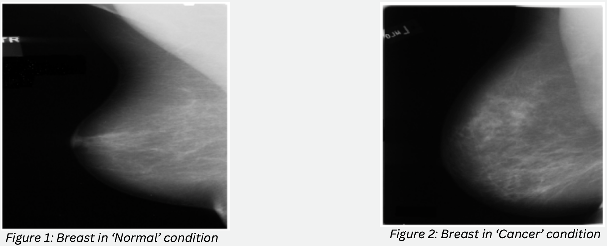
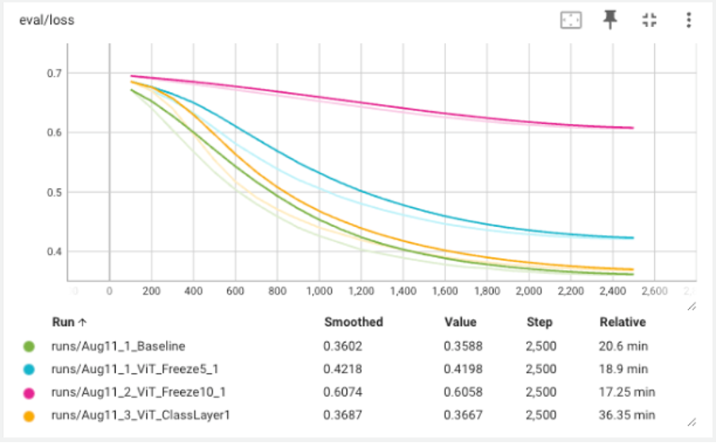
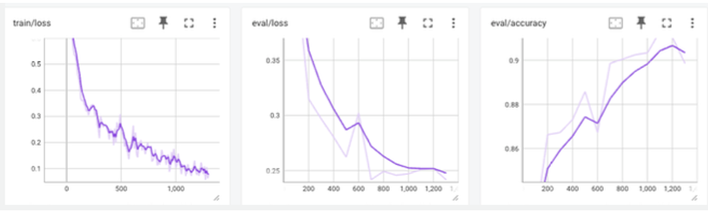
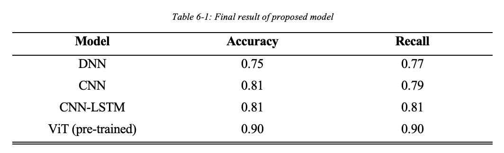
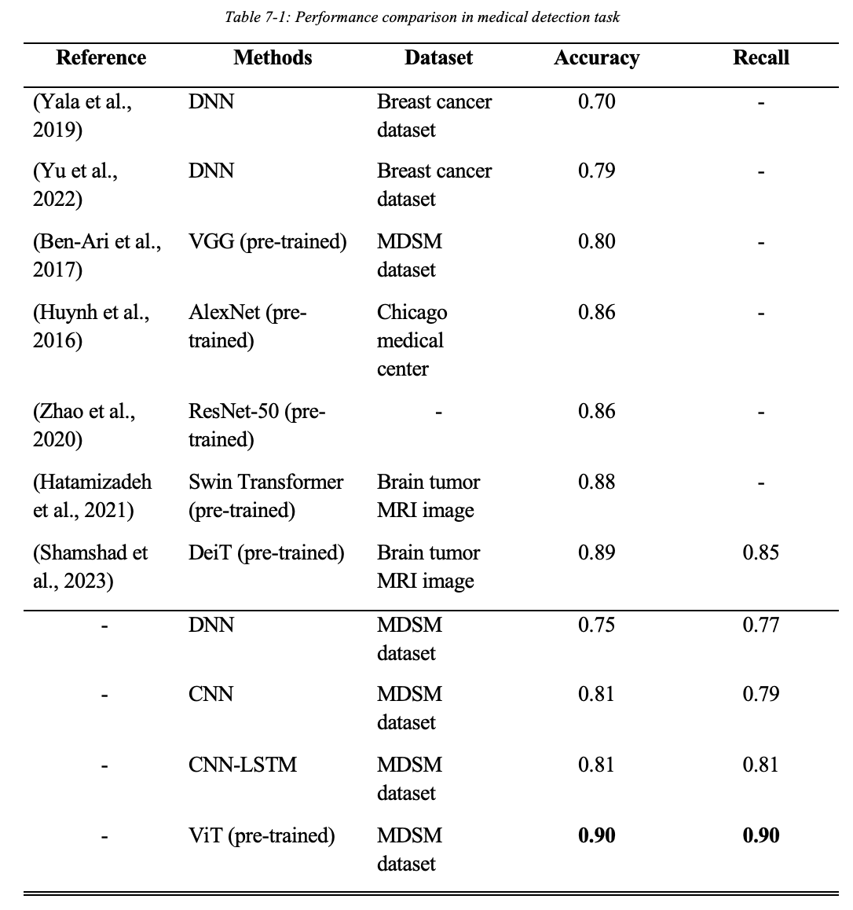
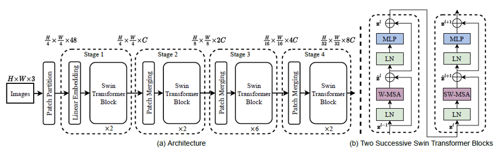
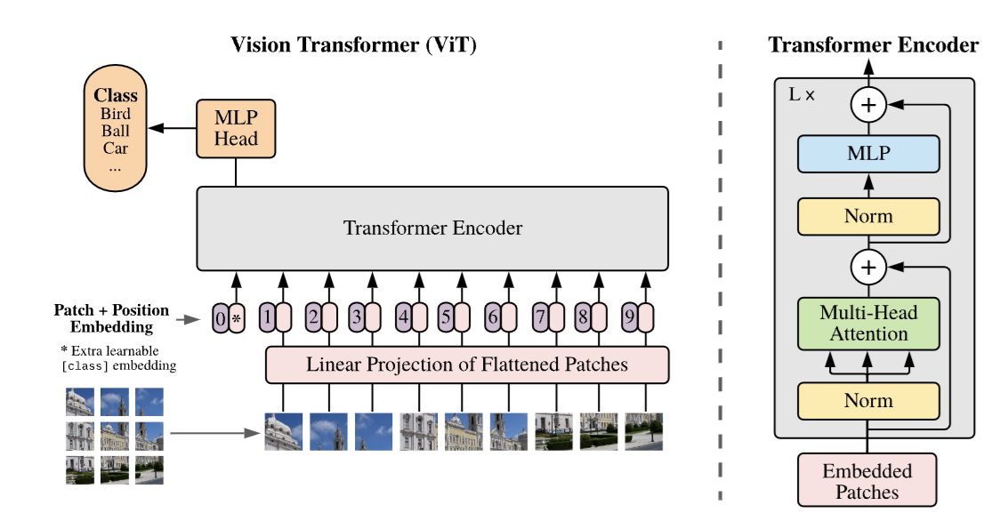

# Breast-Cancer-Detection
A project that detecting breast cancer based on CAD captured images provided ([ddsm](https://www.kaggle.com/datasets/cheddad/miniddsm2))

# Key terms
- DNN 
- CNN
- ViT Pre-trained 
- Utilizing ViT from hugging face ([source](https://huggingface.co/google/vit-base-patch16-224))
- Fine-tuning
- Freezing layers

# Visualization
Single channel image provided by MDSM 

<figure style="text-align: left;">
  
</figure>

# ViT Architecture Exploring
## Design
- Baseline + Fine tune
- Freeze 5 + Fine tune
- Freeze 10 + Fine tune
- Adding Classification Layer + Fine Tune

## Evaluation

 
Baseline perform the most stable and lowest value of lost across the training.The high loss observed in the frozen architecture models is partly due to the fixed weights, which limits the model's ability to fully adapt to the specific nuances of the new dataset. Additionally, as discussed previously, the DDSM dataset consists of three stacked single-channel images, whereas the pretrained Vision Transformer (ViT) was originally trained on RGB images with three channels. Freezing the lower encoder layers has resulted in many of the generic weights not being directly applicable to our dataset.

<figure style="text-align: left;">
  
  <figcaption>Figure: Validation loss for different architecture design</figcaption>
</figure>

# Result & Discussion
## Loss

 
The training and validation loss graphs show a consistent downward trend, indicating effective learning. The fluctuation in training loss may be due to the ViT pre-trained model, which was originally trained on 3-channel RGB images, now being used with grayscale images stacked into 3 channels. Despite this, the validation loss remains stable, suggesting successful fine-tuning as the model adapts well to the grayscale images.

<figure style="text-align: left;">
  
  <figcaption>Figure: Train & Validation Analysis</figcaption>
</figure>

## Accuracy
As a result, ViT had outperformed other model which ahchived a 90% accuracy / recall.

<figure style="text-align: left;">
  
</figure>

 
 
Additionaly, based on the baseline benchmarking, ViT had outperfomred other models. Swin Transformer which rely on using multiple ‘window’ transformer block to filter and capture the local feature from the image and this is one of the main reasons it has lower prediction result compared to the Vision Transformer designed model since in ViT it allows the encoder to compute weight base on the global feature. This capability enhances the model's ability to understand and integrate comprehensive, long-range dependencies within the image, leading to improved communication and overall performance. The global feature approach of ViT thus provides a distinct advantage, contributing to its superior results in comparison to models like Swin Transformer.

 
<figure style="text-align: left;">
  
</figure>

# Futher Enhancement
- Play with larger pre-trained like the ViT-Large / ViT-Huge
- Stacking CNN with ViT (lightweight model) -> force ViT learning paying attention on important feature only ([Ref](https://arxiv.org/pdf/2107.04575))

# Appendix
<figure style="text-align: left;">
  
  <figcaption>Figure: Swin Transformer Architecture</figcaption>
</figure>

<figure style="text-align: left;">
  
  <figcaption>Figure: Vision Transformer Architecture</figcaption>
</figure>